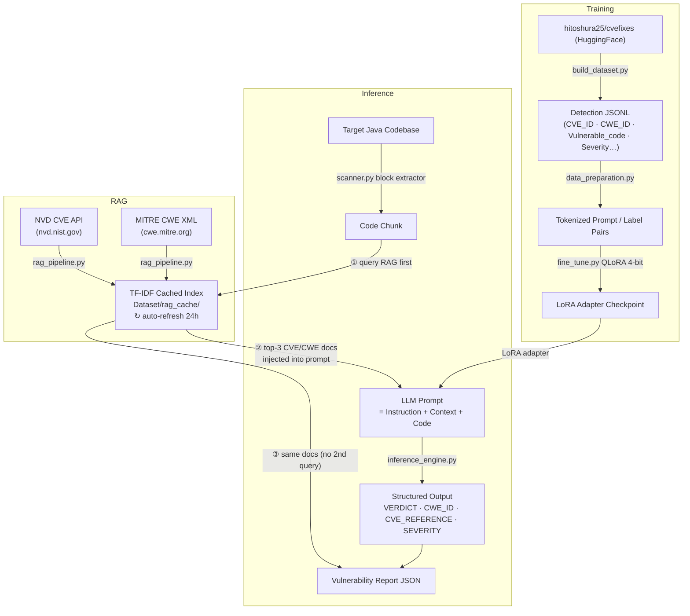

# Java Vulnerability Detection Pipeline — QLoRA + RAG

A modular, production-ready Python pipeline that fine-tunes a domain-specific LLM (e.g. `bigcode/starcoder2-3b` or `codellama/CodeLlama-7b-hf`) using **QLoRA** to **detect and classify** security vulnerabilities in Java code. A **Retrieval-Augmented Generation (RAG)** layer fetches live CVE/CWE intelligence from NIST NVD and MITRE, injects it directly into the LLM prompt **before inference**, and saves the same retrieved data to the scan report — one RAG call per chunk, zero hallucination.

> **Detection-only by design.** The model outputs a structured `VERDICT / CWE_ID / CVE_REFERENCE / SEVERITY / DESCRIPTION` block. It does **not** generate code fixes.

---

## Architecture



### Key design decision — RAG before inference

The RAG pipeline is queried **before** the LLM sees the code. Retrieved CVE/CWE facts are injected into the prompt so the model produces **grounded** classifications, not hallucinated IDs. The same retrieved documents are reused directly for the JSON report — no second query needed.

```
code chunk → RAG query (top-3 docs)
                 ├─→ compact context block  ──┐
                 └─→ saved for report data    │
                                             ▼
             LLM prompt = Instruction + [CVE/CWE Context] + Code
                                             ▼
             VERDICT / VULNERABILITY_TYPE / CWE_ID / CVE_REFERENCE / SEVERITY
                                             ▼
                             vulnerability_report.json
```

---

## File Structure

```
AMD/
├── README.md               — This file
├── requirements.txt        — Python dependencies
│
├── build_dataset.py        — Downloads hitoshura25/cvefixes, filters Java,
│                             writes detection-only JSONL to Dataset/
│
├── data_preparation.py     — PyTorch Dataset + DataCollator for QLoRA training
│                             Loads new JSONL schema, formats detection prompts
│
├── fine_tune.py            — QLoRA 4-bit fine-tuning via PEFT + HuggingFace Trainer
│
├── inference_engine.py     — Loads base model + LoRA adapter; analyze_snippet()
│                             accepts optional rag_context injected into prompt
│
├── rag_pipeline.py         — Fetches Java CVE/CWE data from NVD + MITRE,
│                             caches locally (24h TTL), TF-IDF retrieval
│
├── scanner.py              — Recursively scans Java codebases; per chunk:
│                             (1) queries RAG, (2) injects context into prompt,
│                             (3) runs inference, (4) saves enriched JSON report
│
└── Dataset/
    ├── java_vuln_dataset.jsonl   — Generated detection dataset
    └── rag_cache/
        ├── java_cves.json        — Cached NVD CVE records  (auto-refresh 24h)
        └── cwe_catalog.json      — Cached MITRE CWE catalog
```

---

## JSONL Dataset Schema

Each record in `Dataset/java_vuln_dataset.jsonl`:

```jsonc
{
  "CVE_ID":         "CVE-2021-44228",
  "CWE_ID":         "CWE-502",
  "CWE_Number":     "502",
  "Vulnerable_code": "public void ...",
  "cwe_name":       "Deserialization of Untrusted Data",
  "cvss_score":     10.0,
  "severity":       "CRITICAL",
  "commit_message": "Fix Log4Shell RCE ...",
  "repo_url":       "https://github.com/...",
  "language":       "java"
}
```

---

## LLM Prompt Format (with RAG context injected)

What the model actually receives at inference time:

```
### Instruction: Analyze the following Java code snippet and determine whether
it contains a security vulnerability. If a vulnerability is detected, identify
its type, CWE classification, CVE reference (if known), and severity.
Output format:
  VERDICT: <VULNERABLE | SAFE>
  VULNERABILITY_TYPE: <short name, e.g. SQL Injection>
  CWE_ID: <e.g. CWE-89>
  CVE_REFERENCE: <e.g. CVE-2021-12345 or UNKNOWN>
  SEVERITY: <CRITICAL | HIGH | MEDIUM | LOW | UNKNOWN>
  DESCRIPTION: <one-sentence explanation>

### Relevant CVE/CWE Context (use to inform your classification):
- CVE-2021-99001 | Severity: CRITICAL (CVSS 9.8) | CWE: CWE-89 | SQL injection via...
- CWE-89: SQL Injection — The software constructs all or part of an SQL command...

### Input:
<java code snippet>

### Response:
```

## Model Output Format

```
VERDICT: VULNERABLE
VULNERABILITY_TYPE: SQL Injection
CWE_ID: CWE-89
CVE_REFERENCE: CVE-2021-99001
SEVERITY: CRITICAL
DESCRIPTION: Dynamic query construction using string concatenation allows attacker-controlled SQL execution.
```

---

## Installation

```bash
pip install -r requirements.txt
```

> **Optional (recommended):** Get a free [NVD API key](https://nvd.nist.gov/developers/request-an-api-key) for higher rate limits (50 req/30s vs 5 req/30s without a key).

---

## Usage Guide

### Step 1 — Build the Detection Dataset

```bash
python build_dataset.py
# Output: Dataset/java_vuln_dataset.jsonl
```

### Step 2 — Fine-Tune (QLoRA)

```bash
python fine_tune.py \
    --model_id "bigcode/starcoder2-3b" \
    --dataset_path "Dataset/java_vuln_dataset.jsonl" \
    --output_dir "./adapters" \
    --epochs 3 \
    --batch_size 4
```

### Step 3 — Run Single Snippet Inference

```bash
python inference_engine.py \
    --model_id "bigcode/starcoder2-3b" \
    --adapter_path "./adapters" \
    --snippet_path "path/to/Snippet.java"
```

### Step 4 — Scan a Codebase

```bash
python scanner.py \
    --model_id "bigcode/starcoder2-3b" \
    --adapter_path "./adapters" \
    --target_dir "path/to/java/project" \
    --output_report "vulnerability_report.json"
```

RAG flags:

| Flag | Effect |
|---|---|
| `--nvd_api_key KEY` | Higher NVD rate limits (recommended) |
| `--rag_refresh` | Force re-fetch CVE/CWE caches from internet |
| `--no_rag` | Skip RAG entirely — faster, offline, but ungrounded |

### Step 5 — RAG Pipeline Standalone

```bash
# Query for CVE/CWE context
python rag_pipeline.py --query "SQL injection JDBC PreparedStatement" --top_k 5

# Direct lookups
python rag_pipeline.py --lookup_cve CVE-2021-44228
python rag_pipeline.py --lookup_cwe CWE-89

# Force refresh
python rag_pipeline.py --refresh --nvd_api_key "YOUR_KEY"
```

---

## Vulnerability Report Format

`vulnerability_report.json` per finding:

```jsonc
{
  "file_path": "src/main/java/Dao.java",
  "start_line": 42,
  "end_line": 58,
  "suspected_vulnerability": "VERDICT: VULNERABLE\nVULNERABILITY_TYPE: SQL Injection\nCWE_ID: CWE-89\nCVE_REFERENCE: CVE-2021-99001\nSEVERITY: CRITICAL\nDESCRIPTION: ...",
  "severity": "CRITICAL",
  "original_code": "...",
  "cve_details": [
    {
      "cve_id": "CVE-2021-99001",
      "description": "...",
      "cvss_score": 9.8,
      "severity": "CRITICAL",
      "cwe_ids": ["CWE-89"],
      "published": "2021-03-01"
    }
  ],
  "cwe_details": [
    {
      "cwe_id": "CWE-89",
      "name": "SQL Injection",
      "description": "...",
      "url": "https://cwe.mitre.org/data/definitions/89.html"
    }
  ]
}
```

> `cve_details` and `cwe_details` come from the **same RAG query** used to build the prompt — no duplicate network calls.

---

## License & Ethics

This tool is designed strictly for **defensive application security testing**. Only use it on codebases you are authorized to analyze.
