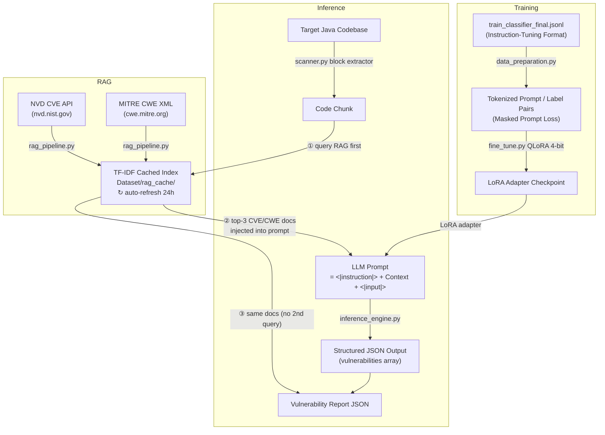

# Java Vulnerability Detection Pipeline — QLoRA + RAG

A modular, production-ready Python pipeline that fine-tunes a domain-specific LLM (e.g., `bigcode/starcoder2-3b` or `codellama/CodeLlama-7b-hf`) using **QLoRA** to **detect and classify** security vulnerabilities in Java code. 

A **Retrieval-Augmented Generation (RAG)** layer fetches live CVE/CWE intelligence from NIST NVD and MITRE, injects it directly into the LLM prompt **before inference**, and saves the same retrieved data to the scan report — one RAG call per chunk, zero hallucination.

> **Detection-only by design.** The model outputs a structured JSON `vulnerabilities` array. It does **not** generate code fixes.

---

## Architecture



---

## File Structure

```
AMD/
├── README.md               — This file
├── requirements.txt        — Python dependencies
│
├── data_preparation.py     — PyTorch Dataset + DataCollator for QLoRA training
│                             Parses <|instruction|>/<|input|>/<|response|> format
│                             and masks prompts during training
│
├── fine_tune.py            — QLoRA 4-bit fine-tuning via PEFT + HuggingFace Trainer
│
├── inference_engine.py     — Loads base model + LoRA adapter; analyze_snippet()
│                             injects RAG context and parses JSON model output
│
├── rag_pipeline.py         — Fetches Java CVE/CWE data from NVD + MITRE,
│                             caches locally (24h TTL), TF-IDF retrieval
│
├── scanner.py              — Recursively scans Java codebases; per chunk:
│                             (1) queries RAG, (2) runs inference,
│                             (3) saves enriched JSON report
│
└── Dataset/
    ├── train_classifier_final.jsonl  — The instruction-tuning training dataset
    └── rag_cache/
        ├── java_cves.json            — Cached NVD CVE records  (auto-refresh 24h)
        └── cwe_catalog.json          — Cached MITRE CWE catalog
```

---

## Dataset Format

The pipeline trains on `Dataset/train_classifier_final.jsonl`. Each record must contain a single `"text"` field using the following special tokens format:

```jsonc
{
  "text": "<|instruction|>\nAnalyze the Java code and identify ALL security vulnerabilities. Return structured JSON only.\n\n<|input|>\npublic void process(String input) throws Exception {\n    Statement stmt = conn.createStatement();\n    ResultSet rs = stmt.executeQuery(\n        \"SELECT * FROM users WHERE name = '\" + input + \"'\");\n}\n\n<|response|>\n{\n  \"vulnerabilities\": [\n    {\n      \"cwe_id\": \"CWE-89\",\n      \"cwe_name\": \"SQL Injection (CWE-89)\",\n      \"severity\": \"critical\",\n      \"confidence\": 0.97,\n      \"location\": {\n        \"start_line\": 1,\n        \"end_line\": 5,\n        \"function\": \"process\"\n      },\n      \"description\": \"Unsanitised input concatenated into SQL query.\",\n      \"impact\": \"Data exfiltration or destruction.\",\n      \"recommendation\": \"Use PreparedStatement with parameterised queries.\"\n    }\n  ]\n}"
}
```

*Safe code examples have an empty vulnerabilities array: `{ "vulnerabilities": [] }`.*

---

## LLM Prompt Format (with RAG context injected)

What the model actually receives at inference time:

```
<|instruction|>
Analyze the Java code and identify ALL security vulnerabilities. Return structured JSON only.

Relevant CVE/CWE context (use to inform your classification):
- CVE-2021-99001 | Severity: CRITICAL (CVSS 9.8) | CWE: CWE-89 | SQL injection via...
- CWE-89: SQL Injection — The software constructs all or part of an SQL command...

<|input|>
<java code snippet>

<|response|>
```

The model generates the corresponding JSON block directly following the `<|response|>` token.

---

## Installation

```bash
pip install -r requirements.txt
```

> **Optional (recommended):** Get a free [NVD API key](https://nvd.nist.gov/developers/request-an-api-key) for higher rate limits (50 req/30s vs 5 req/30s without a key).

---

## Usage Guide

### Step 1 — Fine-Tune (QLoRA)

Ensure your dataset is at `Dataset/train_classifier_final.jsonl`, then run:

```bash
python fine_tune.py \
    --model_id "bigcode/starcoder2-3b" \
    --dataset_path "Dataset/train_classifier_final.jsonl" \
    --output_dir "./adapters" \
    --epochs 3 \
    --batch_size 4
```

### Step 2 — Run Single Snippet Inference

```bash
python inference_engine.py \
    --model_id "bigcode/starcoder2-3b" \
    --adapter_path "./adapters" \
    --snippet_path "path/to/Snippet.java"
```

### Step 3 — Scan a Codebase

```bash
python scanner.py \
    --model_id "bigcode/starcoder2-3b" \
    --adapter_path "./adapters" \
    --target_dir "path/to/java/project" \
    --output_report "vulnerability_report.json"
```

RAG flags:

| Flag | Effect |
|---|---|
| `--nvd_api_key KEY` | Higher NVD rate limits (recommended) |
| `--rag_refresh` | Force re-fetch CVE/CWE caches from internet |
| `--no_rag` | Skip RAG entirely — faster, offline, but ungrounded predictions |

### Step 4 — RAG Pipeline Standalone

```bash
# Build/Refresh the RAG cache (without API key — slower due to rate limits)
python rag_pipeline.py --refresh

# Build/Refresh the RAG cache (with API key — much faster)
python rag_pipeline.py --refresh --nvd_api_key "YOUR_KEY"

# Query for CVE/CWE context manually
python rag_pipeline.py --query "SQL injection JDBC PreparedStatement" --top_k 5

# Direct lookups
python rag_pipeline.py --lookup_cve CVE-2021-44228
python rag_pipeline.py --lookup_cwe CWE-89
```

---

## Vulnerability Report Format

`vulnerability_report.json` per finding:

```jsonc
{
  "file_path": "src/main/java/Dao.java",
  "start_line": 42,
  "end_line": 58,
  "suspected_vulnerabilities": [
    {
      "cwe_id": "CWE-89",
      "cwe_name": "SQL Injection (CWE-89)",
      "severity": "critical",
      "confidence": 0.95,
      "location": {"start_line": 42, "end_line": 58, "function": "..."}
      /* ... other JSON fields from model output ... */
    }
  ],
  "rag_severity": "CRITICAL",
  "original_code": "...",
  "cve_details": [
    {
      "cve_id": "CVE-2021-99001",
      "description": "...",
      "cvss_score": 9.8,
      "severity": "CRITICAL",
      "cwe_ids": ["CWE-89"],
      "published": "2021-03-01"
    }
  ],
  "cwe_details": [
    {
      "cwe_id": "CWE-89",
      "name": "SQL Injection",
      "description": "...",
      "url": "https://cwe.mitre.org/data/definitions/89.html"
    }
  ]
}
```

> `cve_details` and `cwe_details` come from the **same RAG query** used to build the prompt — no duplicate network calls.

---

## License & Ethics

This tool is designed strictly for **defensive application security testing**. Only use it on codebases you are authorized to analyze.
