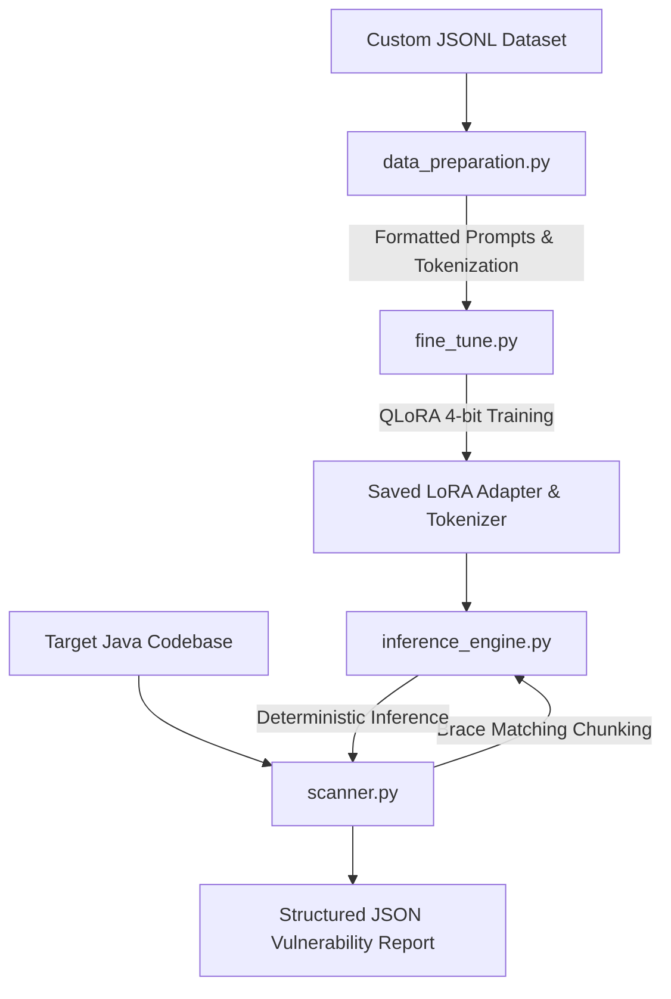

# LLM Java Vulnerability Scanner & QLoRA Fine-Tuning Pipeline

A modular, production-ready Python codebase built completely from scratch using raw PyTorch and the Hugging Face ecosystem. This pipeline fine-tunes a domain-specific Large Language Model (e.g., `BigCode/starcoder2-3b` or `CodeLlama-7b-hf`) using QLoRA (Quantized Low-Rank Adaptation) to detect security vulnerabilities in Java code and output precise remediations. It also features a localized static code scanner that recursively chunks files and runs inference to generate structured JSON vulnerability reports.

---

## Architecture Overview



### 1. `data_preparation.py`
Loads a custom JSONL dataset mapping `vuln_code`, `description`, and `fixed_code`. It formats these entries using a structured instruction template, tokenizes them dynamically, handles sequence length padding/truncation, and correctly prepares causal LM labels (masking prompt tokens).

### 2. `fine_tune.py`
Performs QLoRA fine-tuning. It loads the base model in 4-bit precision (`BitsAndBytesConfig`), prepares the model for k-bit training (`peft.prepare_model_for_kbit_training`), targets all linear layers with LoRA adapter configuration, initializes the `Trainer` with cosine annealing learning rate scheduler, and saves the adapter checkpoint.

### 3. `inference_engine.py`
Implements an optimized inference pipeline combining the base model with the trained LoRA adapter. It provides `analyze_snippet(code: str)` utilizing deterministic decoding (temperature = 0.0) to parse snippets and output vulnerability assessments and remediations.

### 4. `scanner.py`
A static analysis tool that recursively walks directories to locate `.java` files, isolates logical code chunks (using brace matching for classes/methods or sliding windows), runs them through the inference engine, and compiles a structured JSON vulnerability report.

---

## Directory Structure

```text
/home/dwijo/Desktop/AMD/
├── README.md               # Project configuration and guide
├── requirements.txt         # Core dependencies
├── data_preparation.py      # Dataset loader and tokenization utilities
├── fine_tune.py             # QLoRA fine-tuning script
├── inference_engine.py      # Local inference pipeline (Base + LoRA)
└── scanner.py               # Static scanner and reporter utility
```

---

## Installation & Setup

1. **Install Dependencies**:
   ```bash
   pip install -r requirements.txt
   ```

2. **Prepare Training Data**:
   Ensure you have a JSONL dataset file (e.g., `vuln_dataset.jsonl`) with the following format on each line:
   ```json
   {"vuln_code": "public void vuln()...", "description": "SQL Injection vulnerability", "fixed_code": "public void safe()..."}
   ```

---

## Usage Guide

### 1. Fine-Tune the Model
To initiate 4-bit quantized training using PEFT LoRA adapters:
```bash
python fine_tune.py \
    --model_id "bigcode/starcoder2-3b" \
    --dataset_path "vuln_dataset.jsonl" \
    --output_dir "./adapters" \
    --epochs 3 \
    --batch_size 4
```

python export_model.py \
    --model_id "bigcode/starcoder2-3b" \
    --adapter_path "./adapters" \
    --output_dir "./merged_offline_model"


### 2. Run Single Code Snippet Inference
To test the analysis of a specific code snippet with base + adapter model:
```bash
python inference_engine.py \
    --model_id "bigcode/starcoder2-3b" \
    --adapter_path "./adapters" \
    --snippet_path "path/to/Snippet.java"
```
python inference_engine.py \
    --model_id "./merged_offline_model" \
    --snippet_path "path/to/Snippet.java"

python inference_engine.py \
    --model_id "./merged_offline_model" \
    --snippet_path "path/to/Snippet.java" \
    --format json


### 3. Scan a Codebase
To recursively scan a directory containing Java source files:
```bash
python scanner.py \
    --model_id "bigcode/starcoder2-3b" \
    --adapter_path "./adapters" \
    --target_dir "path/to/java/project" \
    --output_report "vulnerability_report.json"
```

---

## License & Safety Guidelines
This tool is designed for **defensive application security testing** and **automated vulnerability remediation**. Use this tool responsibly on codebases you are authorized to analyze.
