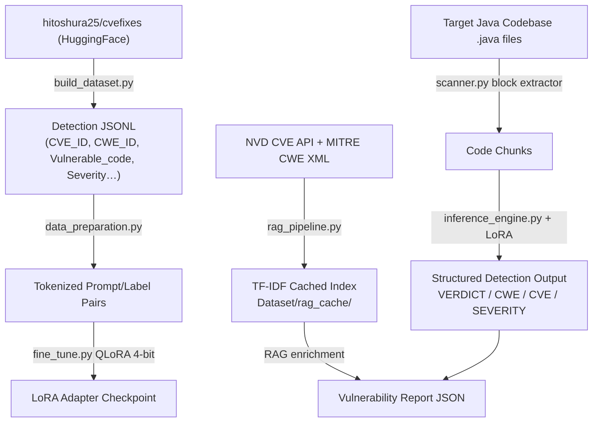

# Java Vulnerability Detection Pipeline — QLoRA + RAG

A modular, production-ready Python pipeline that fine-tunes a domain-specific LLM (e.g. `bigcode/starcoder2-3b` or `codellama/CodeLlama-7b-hf`) using **QLoRA** to **detect and classify** security vulnerabilities in Java code. A **Retrieval-Augmented Generation (RAG)** layer enriches scan reports with live CVE/CWE intelligence from NIST NVD and MITRE.

> **Detection-only by design.** The model is trained to classify vulnerabilities — it outputs a structured `VERDICT / CWE_ID / CVE_REFERENCE / SEVERITY / DESCRIPTION` block. It does **not** generate code fixes.

---

## Architecture



---

## File Structure

```
AMD/
├── README.md               — This file
├── requirements.txt        — Python dependencies
│
├── build_dataset.py        — Downloads hitoshura25/cvefixes, filters Java,
│                             writes detection-only JSONL to Dataset/
│
├── data_preparation.py     — PyTorch Dataset + DataCollator for QLoRA training
│                             (loads new JSONL schema, formats detection prompts)
│
├── fine_tune.py            — QLoRA 4-bit fine-tuning via PEFT + HuggingFace Trainer
│
├── inference_engine.py     — Loads base model + LoRA adapter, runs structured
│                             detection inference on Java code snippets
│
├── rag_pipeline.py         — Fetches latest Java CVE/CWE data from NVD + MITRE,
│                             caches locally, provides TF-IDF retrieval for enrichment
│
├── scanner.py              — Recursively scans Java codebases, chunks methods,
│                             runs inference, enriches findings via RAG, saves JSON report
│
└── Dataset/
    ├── java_vuln_dataset.jsonl   — Generated detection dataset
    └── rag_cache/
        ├── java_cves.json        — Cached NVD CVE records (auto-refreshed every 24h)
        └── cwe_catalog.json      — Cached MITRE CWE catalog
```

---

## JSONL Dataset Schema

Each record in `Dataset/java_vuln_dataset.jsonl` follows this detection-only schema:

```jsonc
{
  "CVE_ID":         "CVE-2021-44228",          // CVE identifier (required)
  "CWE_ID":         "CWE-502",                 // Full CWE ID string
  "CWE_Number":     "502",                     // Numeric portion only
  "Vulnerable_code": "public void ...",        // Raw vulnerable Java snippet
  "cwe_name":       "Deserialization of Untrusted Data",
  "cvss_score":     10.0,                      // CVSS base score (float | null)
  "severity":       "CRITICAL",                // CRITICAL | HIGH | MEDIUM | LOW | UNKNOWN
  "commit_message": "Fix Log4Shell RCE ...",   // Git commit message for context
  "repo_url":       "https://github.com/...",
  "language":       "java"
}
```

---

## Model Output Format (Detection-Only)

The fine-tuned model produces a structured classification block — **no code fix**:

```
VERDICT: VULNERABLE
VULNERABILITY_TYPE: SQL Injection
CWE_ID: CWE-89
CVE_REFERENCE: CVE-2021-99001
SEVERITY: CRITICAL
DESCRIPTION: Dynamic query construction using string concatenation allows attacker-controlled SQL execution.
```

---

## Installation

```bash
pip install -r requirements.txt
```

> **Optional (recommended):** Get a free [NVD API key](https://nvd.nist.gov/developers/request-an-api-key) for higher rate limits when fetching CVE data (50 req/30s vs 5 req/30s without a key).

---

## Usage Guide

### Step 1 — Build the Detection Dataset

Downloads `hitoshura25/cvefixes` from HuggingFace Hub and writes a Java-only detection JSONL:

```bash
python build_dataset.py
# Output: Dataset/java_vuln_dataset.jsonl
```

### Step 2 — Fine-Tune (QLoRA)

```bash
python fine_tune.py \
    --model_id "bigcode/starcoder2-3b" \
    --dataset_path "Dataset/java_vuln_dataset.jsonl" \
    --output_dir "./adapters" \
    --epochs 3 \
    --batch_size 4
```

### Step 3 — Run Single Snippet Inference

```bash
python inference_engine.py \
    --model_id "bigcode/starcoder2-3b" \
    --adapter_path "./adapters" \
    --snippet_path "path/to/Snippet.java"
```

### Step 4 — Scan a Codebase

```bash
python scanner.py \
    --model_id "bigcode/starcoder2-3b" \
    --adapter_path "./adapters" \
    --target_dir "path/to/java/project" \
    --output_report "vulnerability_report.json"
```

Optional RAG flags:
```bash
    --nvd_api_key "YOUR_KEY"   # Faster NVD fetching
    --rag_refresh              # Force re-fetch CVE/CWE cache
    --no_rag                   # Skip enrichment entirely (faster, offline)
```

### Step 5 — Use the RAG Pipeline Standalone

```bash
# Query for relevant CVE/CWE context
python rag_pipeline.py --query "SQL injection JDBC PreparedStatement" --top_k 5

# Look up a specific CVE or CWE
python rag_pipeline.py --lookup_cve CVE-2021-44228
python rag_pipeline.py --lookup_cwe CWE-89

# Force refresh of cached data
python rag_pipeline.py --refresh --nvd_api_key "YOUR_KEY"
```

---

## Vulnerability Report Format

`vulnerability_report.json` structure per finding:

```jsonc
{
  "file_path": "src/main/java/Dao.java",
  "start_line": 42,
  "end_line": 58,
  "suspected_vulnerability": "VERDICT: VULNERABLE\nVULNERABILITY_TYPE: SQL Injection\n...",
  "severity": "CRITICAL",          // Top severity from RAG-retrieved CVEs
  "original_code": "...",          // The flagged Java snippet
  "cve_details": [                 // Top matching CVEs from NVD (via RAG)
    {
      "cve_id": "CVE-2021-99001",
      "description": "...",
      "cvss_score": 9.8,
      "severity": "CRITICAL",
      "cwe_ids": ["CWE-89"],
      "published": "2021-03-01"
    }
  ],
  "cwe_details": [                 // Matching CWE entries from MITRE catalog
    {
      "cwe_id": "CWE-89",
      "name": "SQL Injection",
      "description": "...",
      "url": "https://cwe.mitre.org/data/definitions/89.html"
    }
  ]
}
```

---

## License & Ethics

This tool is designed strictly for **defensive application security testing**. Only use it on codebases you are authorized to analyze.
